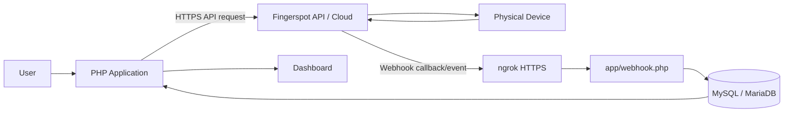
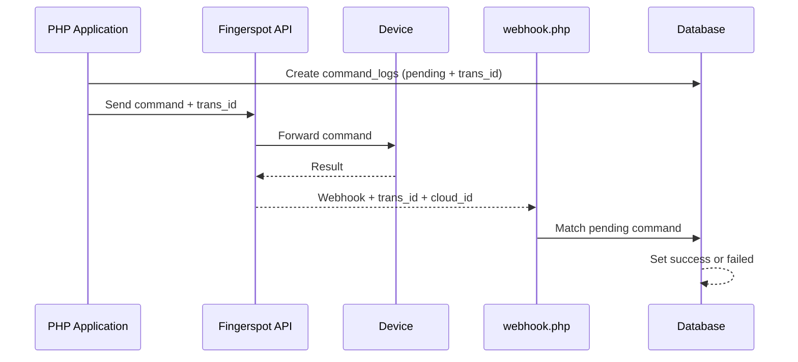

# Task 2 — Integrasi API & Webhook Fingerspot

Aplikasi PHP native untuk mengirim command ke Fingerspot API, menerima callback dan event melalui webhook, menyimpan hasilnya ke MySQL/MariaDB, serta menampilkan riwayat integrasi melalui dashboard.

## Download Project

[Download Task 2 - Fingerspot Integration (ZIP)](./Task2-Fingerspot.zip)

Arsip ZIP tidak menyertakan file `.env` atau credential lokal. Setelah mengunduh, salin `.env.example` menjadi `.env` lalu isi konfigurasi milik Anda.

## Tujuan Project

Project ini dibuat untuk:

- mengirim command melalui Fingerspot API;
- menerima data atau callback melalui webhook;
- menyimpan data utama dan log integrasi ke database;
- mencatat lifecycle request menggunakan `trans_id`;
- menampilkan data, status command, dan payload melalui dashboard.

## API vs Webhook

API adalah jalur keluar dari aplikasi untuk mengirim request atau command:

```text
Application → Fingerspot API → request/command
```

Webhook adalah jalur masuk untuk callback command asynchronous atau event dari perangkat:

```text
Fingerspot Cloud / Device → callback/event → application webhook
```

Pada flow **synchronous**, HTTP response API langsung menentukan hasil akhir command. Pada flow **asynchronous**, response API hanya mengakui request; command tetap `pending` sampai webhook dengan identitas yang cocok diterima atau batas waktu terlewati.

## Architecture



Untuk development lokal, ngrok meneruskan webhook HTTPS publik ke Laragon. Request API keluar menggunakan PHP cURL dan dipaksa ke HTTP/1.1 sesuai workaround transport project.

## Synchronous Flow

### `get_attlog`

```text
Application → Fingerspot API → HTTP response → save attendance → command success/failed
```

`get_attlog` membaca data dari HTTP response API dan tidak menunggu webhook. Data valid disimpan melalui `save_attlogs()`.

### `restart`

`restart` juga diperlakukan synchronous: acknowledgement API yang berhasil menyelesaikan `command_logs` sebagai `success`. Callback `restart`, jika dikirim, hanya mencoba memperbarui row yang masih `pending`; row yang sudah final tidak diubah.

## Asynchronous Flow



Command asynchronous yang diimplementasikan:

- `get_userinfo`
- `get_allpin`
- `set_userinfo`
- `delete_userinfo`
- `set_time`
- `reg_online`

Matching callback mempertimbangkan `trans_id`, status `pending`, tipe command yang diharapkan, dan `cloud_id` jika tersedia.

## Realtime Attendance

```text
Fingerprint scan → Device → Fingerspot Cloud → webhook attlog → attlogs database
```

Webhook realtime `attlog` adalah event mandiri. Event ini menyimpan absensi, tetapi tidak menyelesaikan command `get_attlog` karena lifecycle `get_attlog` selesai dari HTTP response API.

## Webhook Types

| Webhook Type | Purpose | Command Mapping |
|---|---|---|
| `attlog` | Menyimpan event absensi realtime | Tidak memfinalisasi command |
| `get_userinfo` | Menyimpan data user yang diterima | `get_userinfo` |
| `get_allpin` | Mengganti daftar PIN perangkat secara atomik | `get_allpin` |
| `get_userid_list` | Alias callback daftar user/PIN | `get_allpin` |
| `set_userinfo` | Menyimpan hasil operasi set user | `set_userinfo` |
| `delete_userinfo` | Menyimpan hasil operasi hapus user | `delete_userinfo` |
| `set_time` | Menyimpan hasil operasi set waktu | `set_time` |
| `reg_online` | Menyimpan hasil registrasi online | `reg_online` |
| `restart` | Menangani callback restart jika ada | `restart`, pending-only |

Semua webhook yang masuk dicatat di `webhook_responses`. Tipe yang tidak dikenali dicatat sebagai `failed` dengan alasan yang jelas.

## Database

Schema utama berada di [`database/migration.sql`](database/migration.sql), dengan ERD di [`database/erd.mmd`](database/erd.mmd) dan [`database/erd.png`](database/erd.png).

| Table | Purpose |
|---|---|
| `api_requests` | Log endpoint, request, HTTP response, status, dan error API |
| `command_logs` | Lifecycle command berdasarkan `trans_id`: `pending`, `success`, atau `failed` |
| `webhook_responses` | Log webhook masuk dan hasil pemrosesannya |
| `attlogs` | Data absensi per perangkat dan PIN |
| `userinfos` | Data user per perangkat dan PIN |
| `pins` | Daftar PIN/User ID per perangkat |

Integrity rules penting:

- absensi unik: `cloud_id + pin + scan_time + verify + status_scan`;
- PIN unik: `cloud_id + pin`;
- user unik: `cloud_id + pin`;
- index matching command: `trans_id + status + command_type + cloud_id`.

## Idempotency

Absensi yang sama dapat diterima dari pull `get_attlog`, webhook realtime, atau pengambilan rentang data yang diulang. Kombinasi unique key database dan `INSERT IGNORE` di `save_attlogs()` membuat data identik tidak menghasilkan row duplikat.

Refresh PIN dijalankan dalam transaction: daftar lama hanya diganti apabila seluruh daftar baru berhasil disimpan.

## Pending Timeout

`COMMAND_PENDING_TIMEOUT_MINUTES` menentukan batas tunggu webhook untuk command asynchronous. Default-nya `15` menit.

```text
async pending melewati timeout → failed
notes → Command timed out waiting for webhook
```

Cleanup ringan dijalankan ketika dashboard atau halaman riwayat command dibuka. Hanya command async yang masih `pending` dan lebih tua dari timeout yang diproses. `get_attlog`, `restart`, `success`, dan `failed` tidak disentuh. Late callback tidak dapat mengubah command yang sudah final karena webhook matcher hanya memperbarui status `pending`.

## Security

- credential dan konfigurasi sensitif dibaca dari environment atau `.env`;
- `.env` diabaikan oleh Git;
- webhook secret dibandingkan dengan `hash_equals()`;
- form internal dilindungi CSRF token;
- cookie session memakai `HttpOnly`, `SameSite=Lax`, dan `Secure` ketika HTTPS;
- SSL verification outbound aktif secara default;
- input Cloud ID, PIN, tanggal, dan nama divalidasi;
- query dinamis dibatasi dengan whitelist dan query data menggunakan prepared statements;
- token dan secret tidak ditampilkan dalam dokumentasi atau output pemeriksaan.

## Requirements

Environment pengembangan yang tervalidasi:

- Windows dengan Laragon;
- PHP 8.3.30 CLI (project PHP native);
- MySQL 8.4.3 atau MariaDB yang kompatibel;
- PHP extensions `curl`, `pdo_mysql`, dan JSON;
- ngrok untuk webhook HTTPS publik saat development lokal;
- akun Fingerspot Developer;
- API token dan Cloud ID perangkat.

## Installation

1. Clone repository atau salin project ke folder web Laragon, misalnya `C:\laragon\www\Task2`.
2. Start Apache dan MySQL/MariaDB dari Laragon.
3. Buat database, lalu import `database/migration.sql` melalui phpMyAdmin atau MySQL client.
4. Salin `.env.example` menjadi `.env`.
5. Isi environment variables dengan credential dan konfigurasi milik Anda. Jangan commit `.env`.
6. Jalankan ngrok menuju port HTTP Laragon:

   ```powershell
   ngrok http 80
   ```

7. Set `FINGERSPOT_WEBHOOK_URL` ke URL HTTPS publik yang menuju `/Task2/app/webhook.php`, sertakan parameter secret sesuai konfigurasi.
8. Daftarkan URL webhook tersebut pada dashboard Fingerspot bila integrasi Anda memerlukannya.
9. Jalankan pemeriksaan konfigurasi:

   ```powershell
   php app/check_config.php
   ```

10. Buka `http://localhost/Task2/app/`.

Langkah ini tidak mengharuskan command perangkat dijalankan saat perangkat offline.

## Environment Variables

| Variable | Required | Purpose | Example |
|---|---|---|---|
| `APP_ENV` | Ya | Mode `development` atau `production` | `development` |
| `FINGERSPOT_API_TOKEN` | Ya untuk API | Bearer token Fingerspot | `your_api_token_here` |
| `FINGERSPOT_CLOUD_IDS` | Ya untuk device command | Satu atau beberapa Cloud ID, dipisahkan koma | `DEVICE001,DEVICE002` |
| `FINGERSPOT_WEBHOOK_URL` | Ya untuk callback | URL publik endpoint webhook | `https://example.ngrok-free.app/Task2/app/webhook.php?secret=your_webhook_secret_here` |
| `FINGERSPOT_WEBHOOK_SECRET` | Wajib di production | Secret autentikasi webhook | `your_webhook_secret_here` |
| `FINGERSPOT_SSL_VERIFY` | Tidak | Verifikasi SSL outbound; default `1` | `1` |
| `COMMAND_PENDING_TIMEOUT_MINUTES` | Tidak | Batas tunggu callback async; default `15` | `15` |
| `DB_HOST` | Tidak | Host database; default `localhost` | `localhost` |
| `DB_NAME` | Ya | Nama database | `fingerspot_app` |
| `DB_USER` | Ya | User database | `your_database_user` |
| `DB_PASS` | Sesuai database | Password database | `your_database_password` |

## Local Development

Aplikasi Laragon tersedia di:

```text
http://localhost/Task2/app/
```

Webhook harus menggunakan URL HTTPS publik yang diteruskan ngrok ke Laragon, misalnya:

```text
https://example.ngrok-free.app/Task2/app/webhook.php?secret=your_webhook_secret_here
```

URL acak ngrok biasanya berubah ketika tunnel dihentikan dan dijalankan ulang, kecuali menggunakan domain statis/reserved. Jika URL berubah, perbarui environment dan registrasi webhook.

## Test / Check Commands

Jalankan dari root project menggunakan Laragon Terminal atau PHP yang sudah ada di `PATH`:

```powershell
php app/check_config.php
php app/check_security.php
php app/check_database.php
php app/check_webhook.php
php app/check_lifecycle.php
php app/check_pending_timeout.php
```

Syntax check seluruh file PHP di PowerShell:

```powershell
$failed = $false
Get-ChildItem app -Recurse -Filter *.php | ForEach-Object {
    php -l $_.FullName
    if ($LASTEXITCODE -ne 0) { $failed = $true }
}
if ($failed) { exit 1 }
```

Script check menggunakan data test lokal atau inspeksi source dan tidak perlu memanggil API Fingerspot. `check_database.php` dan `check_pending_timeout.php` memerlukan database lokal yang aktif.

## Testing Status

### Completed

- configuration check;
- security check dan webhook authentication;
- database integrity dan PIN transaction rollback;
- webhook handler mock/mapping;
- duplicate attendance/webhook idempotency;
- lifecycle synchronous vs asynchronous;
- pending command timeout dan late callback guard;
- PHP syntax;
- workaround transport HTTP/1.1;
- real API `get_attlog`: HTTP 200 dan `success=true`.

### Pending Device E2E

Device fisik sedang offline. Pengujian berikut belum boleh dinyatakan PASS:

- Get Device pada device asli;
- Get All PIN pada device asli;
- Get Userinfo pada device asli;
- realtime fingerprint scan;
- write commands seperti set/delete user dan set time;
- restart perangkat.

## Troubleshooting

### PHP command not recognized

Gunakan Laragon Terminal atau tambahkan folder PHP Laragon ke `PATH`. Pada instalasi yang diaudit, executable tersedia di folder versi PHP di bawah `C:\laragon\bin\php`.

### `cURL Recv failure: Connection was reset`

Project menggunakan HTTP/1.1 untuk request Fingerspot karena diagnosis pada environment pengembangan menunjukkan transport default PHP cURL mengalami intermittent reset. Ini adalah workaround environment project, bukan klaim bahwa terdapat bug definitif pada Fingerspot.

### Webhook unauthorized

Pastikan URL terdaftar membawa parameter `secret` yang sama dengan `FINGERSPOT_WEBHOOK_SECRET`. Jangan menaruh secret asli dalam dokumentasi atau log publik.

### Webhook tidak masuk

Periksa apakah tunnel ngrok hidup, URL HTTPS masih benar, path webhook tepat, secret sesuai, dan request terlihat di ngrok inspector.

### Command pending

Device mungkin offline atau callback belum tiba. Command async yang tetap `pending` akan otomatis menjadi `failed` setelah melewati `COMMAND_PENDING_TIMEOUT_MINUTES` ketika dashboard atau riwayat command dibuka.

## Project Status

| Area | Status |
|---|---|
| Backend/API/Webhook foundation | **Stable** |
| Real API | **Partially validated** (`get_attlog` berhasil) |
| Full physical device E2E | **Pending device availability** |

Dokumentasi alur lebih rinci tersedia di [`docs/alur-kerja.md`](docs/alur-kerja.md).
