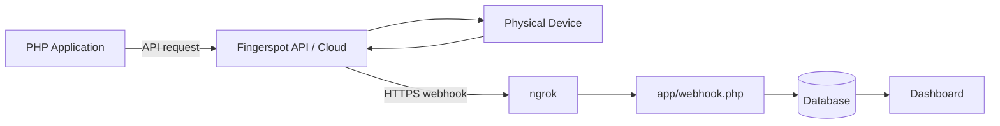
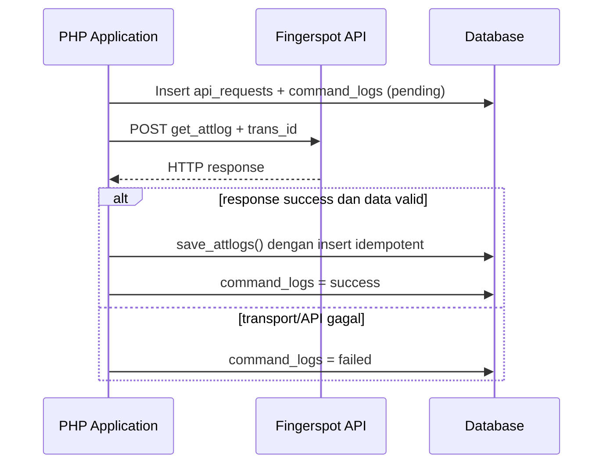
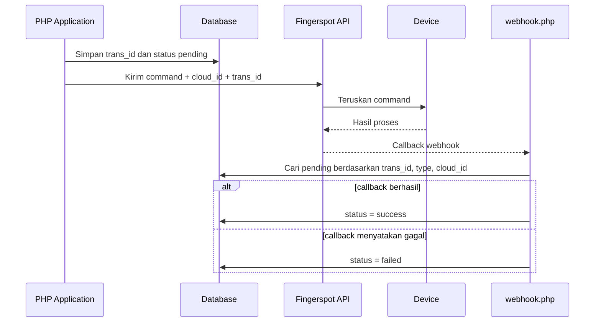
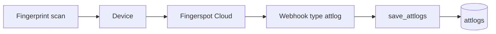
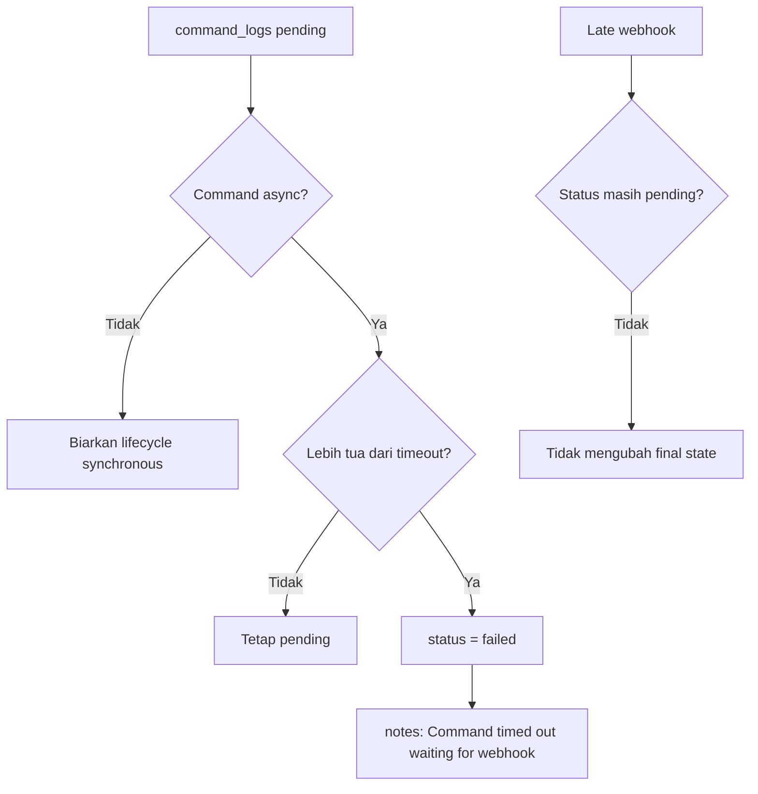
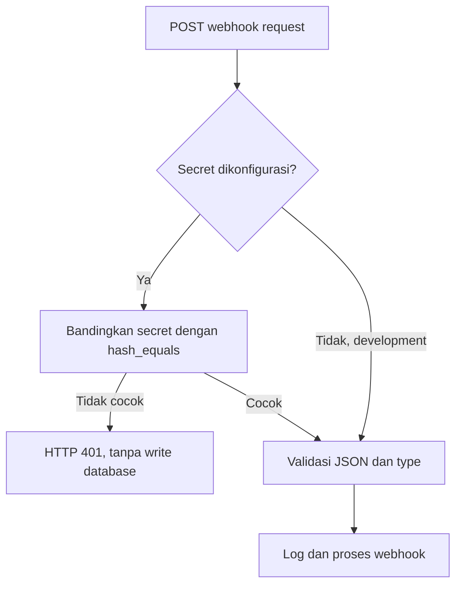
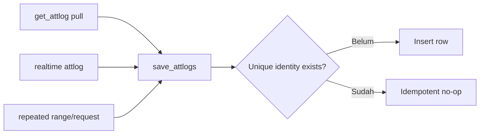

# Alur Kerja API dan Webhook Fingerspot

Dokumen ini menjelaskan lifecycle yang benar-benar diterapkan oleh project `Task2`. Aplikasi memakai API untuk request keluar, webhook untuk callback/event masuk, dan `trans_id` untuk menghubungkan command asynchronous dengan callback-nya.

## Gambaran Umum



## 1. Flow Get Attlog

`get_attlog` adalah command synchronous di project ini.



Flow ini tidak menunggu webhook. Webhook `attlog` adalah event realtime terpisah dan tidak boleh memfinalisasi `get_attlog`.

`restart` juga synchronous: acknowledgement HTTP API yang sukses cukup untuk memfinalisasi command. Callback restart opsional hanya dapat memperbarui row yang masih `pending`.

## 2. Flow Async Command

Command async saat ini adalah `get_userinfo`, `get_allpin`, `set_userinfo`, `delete_userinfo`, `set_time`, dan `reg_online`.



Callback `get_userid_list` dipetakan ke command `get_allpin`. Callback duplikat atau terlambat tidak menimpa row yang sudah final karena matcher mensyaratkan `status='pending'`.

## 3. Flow Realtime Attendance



Event `attlog` memvalidasi data scan lalu menyimpannya ke `attlogs`. Ia tidak memanggil penyelesaian `command_logs` dan tidak berhubungan dengan status command pull `get_attlog`.

## 4. Flow Pending Timeout

Default `COMMAND_PENDING_TIMEOUT_MINUTES` adalah 15 menit.



`expire_pending_commands()` dijalankan ketika dashboard atau riwayat command dibuka. Hanya enam tipe async yang masih `pending` yang dapat expired. Status `success`, `failed`, `get_attlog`, dan `restart` tidak diubah.

## 5. Flow Webhook Authentication



Secret dapat diterima dari query parameter webhook atau header yang didukung source. Di production, konfigurasi tanpa webhook secret dianggap tidak siap. Webhook tidak memakai CSRF karena merupakan endpoint eksternal, tetapi form aplikasi internal tetap memakai CSRF token.

## 6. Flow Duplicate Attendance Prevention



Identitas unik absensi adalah:

```text
cloud_id + pin + scan_time + verify + status_scan
```

Database menerapkan `uniq_attlog_scan`, sedangkan `save_attlogs()` memakai `INSERT IGNORE`. Duplikat dianggap no-op yang valid, bukan processing failure.

## Webhook Type dan Mapping

| Webhook Type | Efek | Command Mapping |
|---|---|---|
| `attlog` | Menyimpan absensi realtime | Tidak ada |
| `get_userinfo` | Upsert data user | `get_userinfo` |
| `get_allpin` | Refresh daftar PIN | `get_allpin` |
| `get_userid_list` | Refresh daftar PIN | `get_allpin` |
| `set_userinfo` | Finalisasi hasil command | `set_userinfo` |
| `delete_userinfo` | Finalisasi hasil command | `delete_userinfo` |
| `set_time` | Finalisasi hasil command | `set_time` |
| `reg_online` | Finalisasi hasil command | `reg_online` |
| `restart` | Pending-only callback handling | `restart` |

## Penyimpanan dan Integrity Rules

| Table | Fungsi |
|---|---|
| `api_requests` | Audit request dan HTTP response API |
| `command_logs` | Lifecycle command dan alasan timeout |
| `webhook_responses` | Audit callback/event webhook |
| `attlogs` | Data absensi |
| `userinfos` | Data user per device |
| `pins` | Daftar PIN per device |

Constraint dan index dari migration aktual:

- `attlogs`: unique `(cloud_id, pin, scan_time, verify, status_scan)`;
- `userinfos`: unique `(cloud_id, pin)`;
- `pins`: unique `(cloud_id, pin)`;
- `command_logs`: index `(trans_id, status, command_type, cloud_id)` untuk matching callback.

Refresh `pins` dibungkus transaction sehingga kegagalan insert tidak meninggalkan daftar parsial.

## State Consistency

- API failure memfinalisasi command sebagai `failed`.
- API success memfinalisasi command synchronous segera.
- API success untuk command async membiarkannya `pending` sampai callback.
- Webhook hanya mengubah command yang masih `pending` dan sesuai mapping.
- Timeout mengubah pending async lama menjadi `failed` dengan catatan.
- Duplicate dan late callback tidak menimpa final state.
